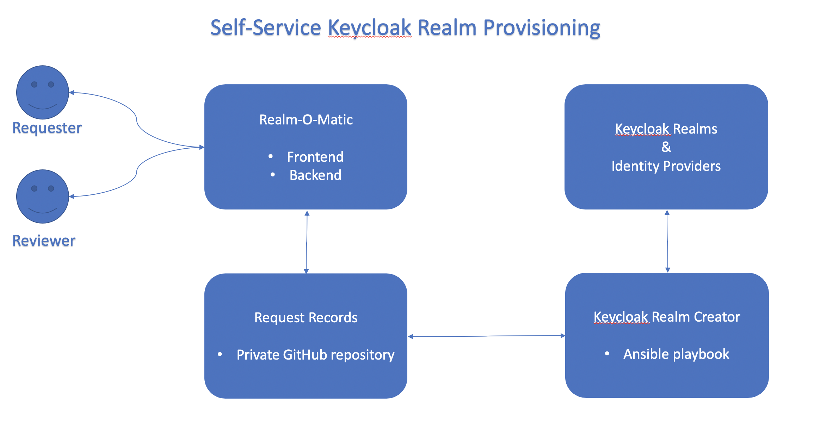

## Self-service App for KeyCloak Realm Provisioning

### Background:
Keycloak Single-Sign On service is provided to BC Gov projects. When project teams integrate Keycloak SSO with the application, they request for their own `realm` in our Keycloak instances. As a standard, three realms will be created for the three project environments `dev`, `test` and `prod`. The realms are created with the requested Identity Provider (IDP), GitHub, IDIR, BCeID and BCSC. Among the four IDPs, BCeID and BCSC require an approval process, which involves form filling and communication between teams. There comes the idea of automating the realm creation and IDP approval process.

### Application Overview:

This repo covers Realm-O-Matic, frontend and backend.
You could find the other components:
- Realm Creator [here](https://github.com/BCDevOps/keycloak-admin)
- Keycloak [here](https://github.com/bcgov/ocp-sso)

### Project Details
This application contains:
- web frontend in React
- api backend in Nodejs Express
- record management with a private GitHub repository
- authenticated via Pathfinder Keycloak

### Project Status
In Development   

### Local Development
1. Prerequisites: npm, docker and docker-compose, ngrok

2. Install project dependencies:
run `npm i` in both /api and /web directories

3. Setup environment variables in a `.env`, based from `.env.sample`

4. Docker deploy using the `docker-compose.yaml`
run `docker-compose up --build` at the root level of the repo 

5. Expose frontend localhost with ngrok `npm ngrok http 3000`

6. Add the ngrok url to Keycloak client's valid redirect uris to enable authentication
